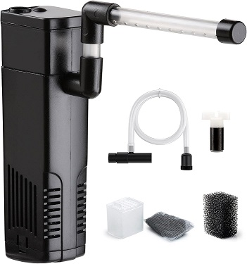
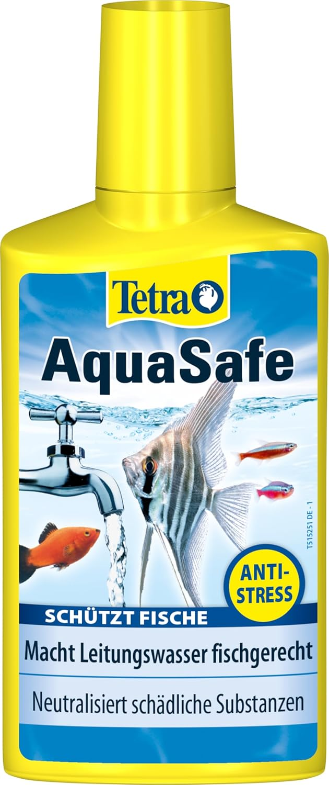
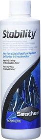
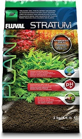
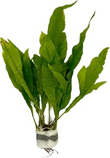
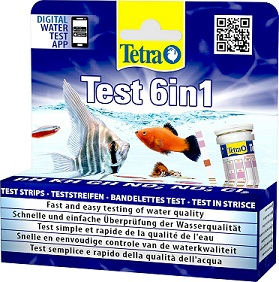
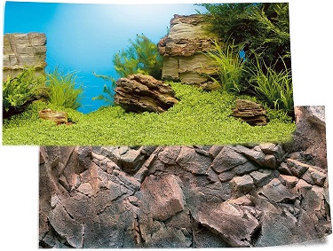

## Introduction

Hi geek!

First of all, I am overwhelmed about the warm welcome the community gave to my project. After my [LinkedIn post](https://www.linkedin.com/posts/jos%C3%A9-ram%C3%B3n-h-572a86234_sideproject-iot-internetofthings-activity-7330849858091667456-7Iyi?utm_source=share&utm_medium=member_desktop&rcm=ACoAADqJK6YB0AXKq7JtwhQGx6J-AAL30zTmZpc) I was able to be in touch with several makers who congratulated me about the idea and we were able to exchange some insights about the IoT and open-source world, it was very enlightful.

I am very determined to carry on with this project since it is (so far) the IoT project of my life. So, in order to continue with the automated aquarium, it is time to buy the neccessary stuff to convert the 4 glass walls into a real subaquatic environment. Since most of the stuff which came with the aquarium is out of date, I made a reseach about what do I need to make my aquarium great again.

## What do I need to buy?

I visited several websites to make a list of which items do I need to have in order to start with my aquarium. The list is below:

- [Water filter](#water-filter).
- [Conditioner for freshwater](#conditioner-for-freshwater).
- [Water treatment for stabilization](#water-treatment-for-stabilization).
- [Substrate for plants](#substrate-for-plants).
- [Natural water plants](#natural-water-plants).
- [Decorations](#decorations).
- [pH test](#ph-test).
- [Wallpaper](#wallpaper).

>[!NOTE]
>This post is not paid by any brand. I chose the different products according to my experience and research. If you, the one who is reading, comes from a brand and would like to sponsor this project, feel free to contact me via my [contact page](../../src/app/contact/).

### Water filter

One of the accessories you must consider is the aquarium filter, as it is essential. This device keeps the water circulating, filtering out all kinds of bacteria and dirt present in the aquarium.

Fish produce all sorts of waste (food leftovers, feces, etc.), which can be harmful to their health over time. A filter helps balance the ecosystem, ensuring that the fish enjoy a suitable and healthy environment.

In my case, I decided to start with the one from NICREW, as their water filters are known for being quiet and easy to install maintain, making them ideal for both beginners and experienced aquarists.

### Conditioner for freshwater

A water conditioner is crucial for making tap water safe for your aquarium inhabitants. Tap water often contains chlorine, chloramine, and heavy metals that can be harmful to fish and plants. Using a conditioner neutralizes these substances, creating a safe environment.

I will go with the Tetra AquaSafe, which instantly makes tap water safe by neutralizing harmful substances and adding essential minerals and vitamins.

[](https://www.amazon.es/Tetra-AquaSafe-736276-Purificador-acuario/dp/B000LXYXG8/ref=sr_1_1_sspa?__mk_es_ES=%C3%85M%C3%85%C5%BD%C3%95%C3%91&crid=3BERV7814AG4I&dib=eyJ2IjoiMSJ9.fLjFBbMITGEJKPDI-YrVMT67gQnXgPPPF8Su6KAFqt3-Mvf1D0L7wiNN-nQ-sTbYsHPkgk5lNN1YJyWR5eWKWJ3z7KR4eJrDMObN874zDQuOKoO5U9FkD0Xddb55NlI6_boyyjLHfkSboh-bX-JS-91AMWKOtjpr0kZEysJRiwaXmIeWjGz8SGUXI0PF1sz5y6oFROI_8uHod70I3lybsh3XMdF0YXZO2Iij0wDMCtjFp9xNvvlkxcotWooCgxCyM1kQkYBB8GlFrpOBm2sEXcpCi2dWtmo_i-sd0YdRirU.jiGeRi7aL4CUJyYasBl9yvrFqMn3bm2QFYtIz9YmShg&dib_tag=se&keywords=Tetra%2BAquaSafe&qid=1749838324&rdc=1&sprefix=tetra%2Baquasafe%2Caps%2C156&sr=8-1-spons&sp_csd=d2lkZ2V0TmFtZT1zcF9hdGY&th=1)

### Water treatment for stabilization

Stabilizing the aquarium's biological balance is essential, especially during the initial setup. Beneficial bacteria help break down waste and prevent harmful ammonia and nitrite spikes.

For this, I use Seachem Stability, a trusted product that quickly establishes the biofilter in freshwater aquariums. It helps prevent "new tank syndrome" and supports a healthy ecosystem from the start.

[](https://www.amazon.es/Seachem-sistema-estabilizaci%C3%B3n-dep%C3%B3sito-estabilidad/dp/B0002APIJG/ref=sr_1_1?crid=2H39WVTTTSBGI&dib=eyJ2IjoiMSJ9.xjn6DY2u5aDgmb-xo9EYaIEmTlrvkKA-ZkrZpGWAHhZF9MKgtJf90R1amjol84ZgVALgLc_U9YODnv0AQ5_UMwgfqSgo4Cd2nZjWpnk7eL8BQ9ZfatH5Hc4PAcoZT-O217ktVedKrHp2CMHKBl6aV0eO-jJznaniciQYBS-2Vbp5d8UhL4JRFdjMqXfP8_Plq5mTTrHU00PDRNYFZ7fvgdgyDJ-aMb73EfLLvyX3C4EEh8GdWFbx6ICLv0EHMFCuzZPwPIw_s2VDEXiIMJAnZJiCWX_nV5-_Zn2-QHweibs.QoQrqbJSZ7m_TuPpopCwsarg-atVJkNRLw__JruhRJE&dib_tag=se&keywords=seachem%2Bstability&qid=1749838354&sprefix=Seachem%2BStability%2Caps%2C83&sr=8-1&th=1)

### Substrate for plants

A nutrient-rich substrate is the foundation for healthy aquatic plants. It provides essential minerals and supports root development, ensuring lush plant growth.

I chose Fluval Plant and Shrimp Stratum, which is rich in minerals and ideal for planted tanks. Its porous structure promotes strong root systems and supports beneficial bacteria.

### Natural water plants

Live plants not only beautify the aquarium but also help maintain water quality by absorbing nitrates and providing oxygen. They create a natural habitat for fish.

For this setup, I selected hardy species like Java Fern (Microsorum Pteropus), known for their resilience and low maintenance. These plants thrive in a variety of conditions and are perfect for both beginners and seasoned aquarists.

### Decorations

Decorations add character to your aquarium and provide hiding spots for fish, reducing stress and encouraging natural behaviors. Choose decorations that are aquarium-safe and easy to clean.

I recommend selecting natural-looking driftwood or rock-looking decorations to create a comfortable and visually appealing environment for your aquatic pets.

### pH test

Ince the tank is filled and the treatment products mentioned are underway, I want to make a pH test before adding any fish in it. A pH test kit allows you to monitor the water's acidity and ensure it stays within the optimal range for your fish and plants.

The Tetra Test 6in1 kit is a convenient option, providing quick and accurate readings for six key water parameters, including pH, in a single step.

[](https://www.amazon.es/Tetra-Test-6-en-1/dp/B001B65ZVQ/ref=sr_1_6?__mk_es_ES=%C3%85M%C3%85%C5%BD%C3%95%C3%91&crid=19I3RN1IPE319&dib=eyJ2IjoiMSJ9.OLZyMtnQKDPI8bbospTP9u0XOrhaurdzLiji0K4-q3tuQ4WCqBWMpTdw0XYZaO_kPLSWlg1OYbetLd7cOFNwLXU07yXox3q1Gu0ROCbf2NGlblQAlSvWpxFvaGvLxTAKPFF8DHdOdqbqM1uSLPMqxY0GoWg7_-Fq36cxVfbtUAZ8dAz6WRChHBOBcOgxrJvXtX73RBgywxCJpuKnr4RRu5BX3e5UJ5muMomVUi7Jg9KR6y4nN_SK5eBsmQWrUGWHVK7HUrNWOBizvulNgChWk6i1KRIASxozkUbA-xtD5N8.ECPScyXSajiGXaoiNF9Fv_CK6UjYjrnizff-O4izAWg&dib_tag=se&keywords=aquarium+ph+test&qid=1749838389&sprefix=aquarium+ph+test%2Caps%2C87&sr=8-6)

### Wallpaper

A background poster enhances the visual appeal of your aquarium and helps hide cables and equipment behind the tank. It also creates a sense of depth and a more natural look.

I opted for the Juwel Ocean Blue Poster, which features a vibrant underwater scene that complements the aquascape and brings the aquarium to life.

## Final result

Here's the complete setup with every component assembled, ready for action and the start of the automated aquarium journey!

Happy automation!

Joserra
